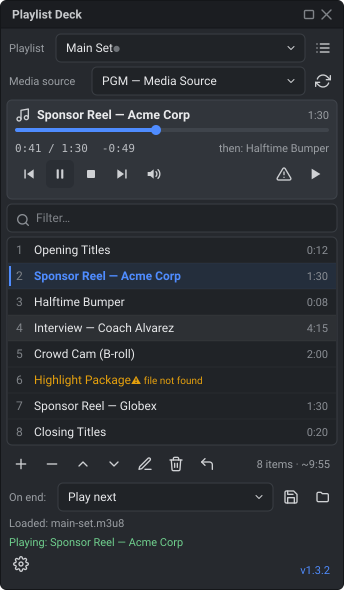

<div align="center">

# 🎬 Playlist Deck for OBS

**Queue, play, and control local media through an existing OBS source — from a native dock.**

[](https://github.com/angeloruggieridj/obs-playlist-deck/actions/workflows/build_project.yml)
[](https://github.com/angeloruggieridj/obs-playlist-deck/releases)
[](https://github.com/angeloruggieridj/obs-playlist-deck/releases)
[](LICENSE)


[](https://github.com/angeloruggieridj/obs-playlist-deck/releases/latest)
[](docs/verification.md)

</div>

Playlist Deck adds a dock to OBS that manages a playlist of local media files and
drives an **existing OBS media source** from it. Pick a source, build your
playlist, and play items through it — you never edit the source's file path by
hand while live. No browser source, no embedded web server: pure OBS + Qt.

<div align="center">



<sub>The dock inside OBS — playlist, source and clip names are fictitious.</sub>

</div>

## Table of contents

- [Features](#features)
- [Installation](#installation)
  - [Windows](#windows)
  - [Linux](#linux)
  - [macOS](#macos-universal)
- [Unsigned builds](#unsigned-builds)
- [Usage](#usage)
- [Playlists, watch folders and scheduled starts](#playlists-watch-folders-and-scheduled-starts)
- [Keyboard](#keyboard)
- [End-of-clip modes](#end-of-clip-modes)
- [Remote control & Stream Deck](#remote-control--stream-deck)
- [Localization](#localization)
- [Compatibility](#compatibility)
- [Building from source](#building-from-source)
- [Changelog](#changelog)
- [License](#license)

## Features

- 🎛️ Native Qt dock inside OBS; bind to any **Media Source** (`ffmpeg_source`)
  or **VLC Source** via a dropdown — each is driven through the settings it
  actually reads, so both really work.
- ▶️ **Now-playing card**: title, elapsed / total / remaining, a **seekable**
  progress bar, transport, and what plays next — the whole live picture in one
  block at the top of the dock.
- 📃 Playlist with add / remove / reorder / **rename** / clear, **multi-select**
  and **undo** (Ctrl+Z); each item shows its **duration**, and the toolbar shows
  the **item count and total running time**.
- 🖱️ **Drag & drop** files from the OS file manager; reorder by drag; missing
  files flagged; a **filter** box with a match count for long playlists.
- 📂 Add a **whole folder** (recursive, sorted the way people read numbers:
  `clip2` before `clip10`), and export the playlist as **CSV**.
- 🔀 Playback modes: **Play next**, **Loop**, **Load next (paused)**, **Stop**,
  **Shuffle** (a real bag shuffle — every clip plays before any repeats),
  **Repeat one**.
- 💾 Save / open playlists as **`.json`** or **`.m3u/.m3u8`**, with **relative
  paths** on request so a gig folder can move between machines; `.m3u` files
  written by other players are read correctly. Optional **auto-restore** of the
  last playlist; **background** duration probing.
- 📚 **A library of named playlists** in one deck — a warm-up set, the main set,
  a folder of stingers — switched from a dropdown and kept between sessions,
  with automatic **backups** you can restore from.
- 👀 **Watch a folder**: media dropped into it joins the playlist by itself.
- ⏰ **Scheduled start**: a playlist can begin at a wall-clock time, counting
  down in the card first so it is never a surprise.
- 🚨 **Panic**: one button (and hotkey, and Stream Deck key) stops playback and
  cuts to a scene you nominate — a stopped media source holds its last frame,
  so stopping alone is not enough.
- 🩹 **Find moved files**: when files are reorganised between shows, the deck
  looks for them by name where its other files live.
- 🔇 **Mute** the bound source from the card, with an optional "unmute when a
  clip starts" — off by default, so the mute stays where you put it.
- ⌨️ Global OBS **hotkeys** (next, previous, play/pause, stop, mute, recheck
  files, play item 1-9) and full **keyboard operation** of the dock itself.
- 🕹️ **Remote control** via obs-websocket — requests *and* live events — plus an
  included **Stream Deck** companion that reconnects on its own and shows the
  current clip on the key.
- 🌍 **Localized** UI (10 languages) — selectable or follow OBS.
- 🔔 Built-in update check (links to the latest release; manual download).

## Installation

Download your platform's build from the
[**Releases**](https://github.com/angeloruggieridj/obs-playlist-deck/releases) page.

> [!IMPORTANT]
> The builds are **not code-signed**, so your OS may block or warn about them the
> first time — on **macOS** you have to clear the download quarantine by hand or
> OBS will refuse to load the plugin. See
> [Unsigned builds, and how to verify them](#unsigned-builds-and-how-to-verify-them).

> [!NOTE]
> **One package for OBS 30 through 33.** OBS 33 moves third-party plugins to a
> new folder layout, and keeps loading the old one — marked *Legacy* in its
> Plugin Manager — only until OBS 34. The Windows and Linux packages carry the
> plugin in **both** layouts: OBS 33 loads the new copy and skips the old one,
> while OBS 32 and earlier only ever see the old one. macOS is unchanged in
> OBS 33.

### Windows
**Installer (recommended):** run `obs-playlist-deck-windows-setup.exe` with
OBS closed. It installs into `C:\ProgramData\obs-studio\plugins` — the folder
OBS searches for plugins on Windows, for every account on the PC — asking for
administrator rights once. Run it again to upgrade; uninstall from Windows
*Settings → Apps*. Your playlists and settings are kept either way. Because the
installer is not code-signed, SmartScreen may warn about it: choose *More info →
Run anyway* (see [Unsigned builds](#unsigned-builds)).

**Zip (manual, or portable OBS):** extract it into the same folder:

```powershell
Expand-Archive obs-playlist-deck-windows.zip -DestinationPath "$env:PROGRAMDATA\obs-studio\plugins" -Force
```
For a portable OBS 33, extract it into the `plugins` folder next to OBS instead.

Either way you end up with `…\plugins\obs-playlist-deck\obs-playlist-deck.dll`
(OBS 33), `…\obs-playlist-deck\bin\64bit\obs-playlist-deck.dll` (OBS 32 and
earlier) and `…\obs-playlist-deck\data\`. Then restart OBS. If Windows refuses
to write there, run PowerShell as administrator.

> [!IMPORTANT]
> Versions up to 1.3.2 told you to install under `%APPDATA%\obs-studio\plugins`.
> **OBS never loads plugins from there on Windows**, so a copy in that folder
> did nothing. The installer offers to remove it; with the zip, delete it by
> hand.

### Linux
Pick the package for your Ubuntu release: the plugin uses the system FFmpeg,
whose libraries have different names on each release, so one build cannot load
on both.

| Ubuntu | Package | OBS |
|---|---|---|
| 24.04 | `obs-playlist-deck-linux-ubuntu-24.04-x86_64.tar.gz` | 30 – 32, from the OBS PPA or OBS's `.deb` |
| 26.04 | `obs-playlist-deck-linux-ubuntu-26.04-x86_64.tar.gz` | 32 – 33, from the OBS PPA, OBS's `.deb` or Ubuntu |

The packages are built against OBS's own `.deb`. Ubuntu 24.04's *own*
`obs-studio` package names its core library differently (`libobs.so.0`, where
OBS's builds use `libobs.so.30`), so the plugin does not load into it — install
OBS from its PPA instead.

Extract it into your home folder — no `sudo`:
```bash
tar -xzf obs-playlist-deck-linux-ubuntu-26.04-x86_64.tar.gz -C ~
```
Then restart OBS. The plugin lands in `~/.local/share/obs-studio/plugins`
(OBS 33) and `~/.config/obs-studio/plugins` (OBS 32 and earlier), which OBS
searches however it was installed: from the OBS PPA, from Ubuntu's own package,
or from the `.deb` on OBS's GitHub releases (which installs under `/usr/local`).
Flatpak and Snap builds of OBS are not covered. OBS 33 no longer publishes
packages for Ubuntu 24.04.

> [!IMPORTANT]
> Versions up to 1.3.2 were installed with `sudo tar … -C /` into
> `/usr/lib/obs-plugins`, a folder OBS on Ubuntu does not search — so they did
> not load. You can remove the leftovers:
> `sudo rm -rf /usr/lib/obs-plugins/libobs-playlist-deck.so /usr/share/obs/obs-plugins/obs-playlist-deck`

### macOS (universal)
```bash
PLUGIN_DIR="$HOME/Library/Application Support/obs-studio/plugins"
mkdir -p "$PLUGIN_DIR"
tar -xzf obs-playlist-deck-macos-universal.tar.gz -C "$PLUGIN_DIR"
# the build is ad-hoc signed (not notarized) — clear the download quarantine once:
xattr -dr com.apple.quarantine "$PLUGIN_DIR/obs-playlist-deck.plugin"
```
Then open OBS → the **Playlist Deck** dock appears under the *Docks* menu.

## Unsigned builds

The releases carry **no publisher signature on any platform** — code-signing
certificates are neither free nor issued to one-person projects. Your OS will
say so: macOS quarantines the plugin (and OBS then fails to load it, silently),
Windows marks the zip as coming from the internet, and SmartScreen warns before
running the installer.

Unsigned does not mean unverifiable. Every release is built in public from the
tagged source, and ships a signed **build provenance attestation**, GitHub's
per-asset **SHA-256 digests** and, when a key is configured, **VirusTotal**
reports.

👉 **[How to verify a download](docs/verification.md)** — what to expect per
platform, and the three checks, with commands.

## Usage

Show or hide the deck from OBS's **Docks** menu — it has a checkable *Playlist
Deck* entry, and OBS remembers whether it was open, where it was docked and how
big it was the next time you start.

1. Add a **Media Source** (or VLC Source) to a scene in OBS.
2. In the Playlist Deck dock, select it from the **Media source** dropdown.
3. **Add** media files (or drag them in, or add a whole folder from the
   right-click menu), then double-click an item — or select it and press
   **Play** — to play it through that source. Every button shows its icon only;
   hover it to read what it does, in your language.
4. Choose an **End-of-clip** behavior, and use **Save** / **Open** to keep
   playlists as files.

Right-click the list for rename, "reset name from file", add folder, export CSV,
recheck missing files, and undo/redo. A destructive edit — remove, clear, an
accidental reorder — is undone with **Ctrl+Z**: there is no confirmation dialog
to dismiss, because an undo that works is worth more than a prompt that gets
clicked through.

Missing files are marked in amber with the words *file not found*, not by colour
alone. The check runs on a worker thread, so a playlist on a network share does
not freeze the dock; **Recheck missing files** runs it again on demand.

The dropdown lists only the media sources of the **active scene collection**. If
you switch to a collection that has no source by the configured name, the
dropdown shows *“No source configured”* and the deck stays unbound — it never
picks a source for you, and never touches a file path you set up in OBS. Your
choice is remembered, so it comes back when you return to the collection that
owns that source.

## Playlists, watch folders and scheduled starts

The **playlist picker** at the top of the dock holds as many playlists as you
like. The button beside it creates, renames, duplicates and deletes them, and
opens **Playlist properties**, where two things belong to that playlist alone:

| Property | What it does |
|---|---|
| **Watch folder** | Media files that appear in this folder are added to this playlist automatically. Files still being copied are given a moment to finish; a file already in the playlist is not added twice. |
| **Start at** | The deck starts this playlist by itself at that wall-clock time. The card counts down to it for the last ten seconds, and a time that has already passed starts immediately rather than being ignored. |

A playlist with either of these shows a mark in the picker (`●` watched,
`⏱` scheduled), because a list that can act on its own should say so where you
choose it.

The library is **always saved and always restored** — a deck that forgot the
sets you named would be broken, not configurable. It is copied aside when OBS
starts, when it closes, and every ten minutes of editing; the last twenty copies
are kept and **Settings → Restore a backup…** brings one back (backing up what
you have first). A `session.json` from 1.3.x becomes the library's first
playlist on upgrade, and is left in place so downgrading loses nothing.

**Panic** stops playback and cuts to the scene named in Settings. Without a
scene configured it still stops, and says so. It is on a button, an OBS hotkey,
a Stream Deck key and the remote API, because that is a thing you press without
looking.

**Find moved files** (list context menu) searches the folders your other clips
live in, the watch folder and the playlist's own folder for a file with the same
name. One match is repaired; two are reported rather than guessed at, because
picking the wrong `intro.mp4` mid-show is worse than saying nothing.

**Import from an OBS source** reads the media paths out of any source that holds
a list of them — a VLC source, OBS's own playlist source, whatever a plugin
adds. It only reads: the deck drives the two source types whose settings it
actually knows, and does not write settings it has never seen.

## Keyboard

The dock is fully operable without a mouse — every control is reachable by Tab,
and the list carries the shortcuts you would expect.

| Key | In the playlist |
|---|---|
| **Enter** | Play the selected item |
| **Delete** | Remove the selection |
| **F2** | Rename the selected item |
| **Ctrl+F** | Jump to the filter box |
| **Ctrl+Z** / **Ctrl+Shift+Z** | Undo / redo the last playlist change |

Global OBS hotkeys (assign them in OBS → Settings → Hotkeys) cover **Next**,
**Previous**, **Play/Pause**, **Stop**, **Panic**, **Mute/unmute**, **Recheck
missing files** and **Play item 1-9** — the last of these is what a MIDI controller or
foot pedal maps to.

## End-of-clip modes

| Mode | Behavior |
|------|----------|
| **Play next** | Auto-advance to the next item. |
| **Loop** | Auto-advance and wrap around. |
| **Load next (paused)** | Hold the finished clip's last frame on Program; load the next clip, paused, as soon as the bound source is **no longer in the Program scene** — a studio-mode transition, a scene change, or the source being taken off air. Until then the card says a clip is staged. The next clip never goes live early and the playlist never auto-advances on air. |
| **Stop** | Stop at the end of the clip. |
| **Shuffle** | Bag shuffle: every item plays once, in random order, before any repeats. |
| **Repeat one** | Replay the current item. |

## Remote control & Stream Deck

Playlist Deck registers an obs-websocket **vendor** named `obs-playlist-deck`.
Call its requests via obs-websocket v5 `CallVendorRequest` from any client or
script.

| Request | Data | Does |
|---|---|---|
| `Next` / `Previous` / `PlayPause` / `Stop` | — | Transport |
| `ToggleMute` | — | Mute or unmute the bound source |
| `SetMute` | `{ muted }` | Set the mute explicitly |
| `PlayIndex` | `{ index }` | Play an item by position (0-based) |
| `Seek` | `{ positionMs }` | Jump inside the current clip |
| `SetMode` | `{ mode }` | End-of-clip mode, `0`-`5` in the order of the table above |
| `Load` | `{ path }` | Open a playlist file (10 MB cap) |
| `Save` | `{ path }` | Write the playlist (format from the extension) |
| `Move` | `{ from, to }` | Reorder one item |
| `Remove` | `{ index }` | Remove one item |
| `Panic` | — | Stop and cut to the panic scene |
| `SwitchPlaylist` | `{ name }` | Make another playlist in the library active |
| `GetPlaylists` | — | The library's playlist names and which is active |
| `AddPaths` | `{ paths: [{ value }] }` | Append media files |
| `Clear` | — | Empty the playlist |
| `GetStatus` | — | See below |
| `GetItems` | `{ from, to }` | `index`, `title`, `path` and `durationMs` of each item, paginated |

`GetStatus` answers with `ok`, `count`, `currentIndex` — the fields it has always
had — plus `currentTitle`, `currentPath`, `positionMs`, `durationMs`, `playing`,
`paused`, `muted`, `sourceBound`, `sourceName`, `mode`, `modeName`,
`playlistName`, `playlistIndex`, `scheduledStartMs`, `upNextIndex`,
`upNextTitle`, `totalDurationMs`, `unknownDurationCount` and `pluginVersion`.
Nothing was removed, so existing scripts keep working. `durationMs` is `-1`
wherever the duration is not known yet (not probed, probing disabled, or the
probe failed); `totalDurationMs` adds up only the known ones, and
`unknownDurationCount` says how many it left out.

The deck also **emits events**, so a client can follow playback instead of
polling: `item-started` (`index`, `title`, `path`, `durationMs`),
`playback-state` (`playing`, `positionMs`, `durationMs`, `index`, about once a
second), `mute-changed` (`muted`), `playlist-completed` and `playlist-changed`
(`reason`, `playlistName`, `count`). `playlist-changed` fires whenever the item
list changes, so a client can call `GetItems` again instead of polling it;
`reason` is one of `added`, `removed`, `moved`, `renamed`, `cleared`, `loaded`,
`switched` (another playlist in the library became active), `undo`, `redo`,
`healed` (*Find moved files* repointed items), `durations-updated` (a
background probe or playback filled in durations) and `playlist-renamed`.

An Elgato **Stream Deck companion** lives in [`streamdeck/`](streamdeck/) with
Next / Previous / Play-Pause / Stop / Mute / Panic / Play Item actions (buildless JS). It
reconnects on its own with backoff, drops rather than replays presses made while
OBS was away, and shows the current clip — or `offline` — on the key. The
property inspector has a **Test connection** button that tells apart a wrong
password from a missing OBS plugin, and picks the clip for *Play Item* **by
name** from the live playlist instead of asking for an index. Grab `obs-playlist-deck-streamdeck.zip` from
a release and copy the `.sdPlugin` folder into your Stream Deck plugins
directory — see [`streamdeck/README.md`](streamdeck/README.md).

## Localization

Bundled languages: **English, Italian, Spanish, French, German, Portuguese (BR),
Russian, Chinese (Simplified), Japanese, Korean**. Pick one in Settings or let it
follow OBS's UI language; any other OBS language falls back to English.

Every user-visible string is translated — status messages and file-dialog titles
included. The shipped [`data/locale/`](data/locale/) files are **generated** from
[`tools/locales.json`](tools/locales.json), which is the one file to edit:

```bash
python tools/gen_locales.py           # rewrite data/locale/*.ini
python tools/gen_locales.py --check   # what CI runs
```

`--check` fails if a language is missing a key, if a translation dropped a `%1`
placeholder, if a file carries a BOM, or if a `.ini` was edited by hand. To add
or fix a translation, change `locales.json`, run the generator, and open a PR.

## Compatibility

<!-- obs-compat:start -->
| | |
|---|---|
| **OBS Studio** | **30.0 – 32.2.2** |
| **Verified by** | Compile and link against each version's OBS SDK in CI — not a runtime test. |
| **Built against** | 32.2.2 |
| **Platforms** | Windows x64, Linux x86_64 (Ubuntu 24.04 and 26.04), macOS universal (Intel + Apple Silicon) |
| **Qt** | Qt 6 — on Windows and macOS, the exact Qt the targeted OBS ships |

<details>
<summary>Every OBS version CI probed</summary>

| OBS | Result | Built on |
|---|---|---|
| `30.0.0` | ✅ compiles and links | Ubuntu 22.04 (container) |
| `30.1.0` | ✅ compiles and links | Ubuntu 22.04 (container) |
| `30.2.0` | ✅ compiles and links | Ubuntu 22.04 (container) |
| `31.0.0` | ✅ compiles and links | Ubuntu 24.04 |
| `31.1.0` | ✅ compiles and links | Ubuntu 24.04 |
| `32.0.0` | ✅ compiles and links | Ubuntu 24.04 |
| `32.1.0` | ✅ compiles and links | Ubuntu 24.04 |
| `32.2.0` | ✅ compiles and links | Ubuntu 24.04 |
| `32.2.2` | ✅ compiles and links | Ubuntu 24.04 |
| `33.0.0-beta6` | ⚠️ SDK could not be built in CI | Ubuntu 24.04 |

Generated from [`obs-compat.json`](obs-compat.json) by `tools/obs_compat.py`.
</details>
<!-- obs-compat:end -->

**OBS 33 is supported only partially, while it is in beta.** The newest OBS 33
prerelease the plugin builds against is listed under "Also builds against" in the
table above; CI checks that the Linux package resolves every library and symbol
it needs inside OBS's own 33 beta package for Ubuntu 26.04. That is not the same
as running a show on it: full compatibility will be tested again, and declared in
that table, when OBS 33 is released to the public.

## Building from source

Requires CMake ≥ 3.22, a C++17 compiler, Qt 6, and OBS development files
(`libobs`, `obs-frontend-api`).

```bash
cmake -B build -DCMAKE_BUILD_TYPE=Release
cmake --build build
```

The install rules lay the plugin out the way OBS looks for it, in both the
OBS 33 and the legacy layout, so installing with the right prefix is a working
install:
```powershell
# Windows
cmake --install build --config Release --prefix "$env:PROGRAMDATA\obs-studio\plugins"
```
```bash
# Linux, per user (the layout the release package uses)
cmake --install build --prefix "$HOME"
# Linux, system-wide under /usr, for distribution packagers
cmake -B build -DPLD_LINUX_LAYOUT=system && sudo cmake --install build
```

Unit tests (no OBS/Qt needed):
```bash
cmake -B build-tests -DBUILD_PLUGIN=OFF -DBUILD_TESTS=ON
cmake --build build-tests
ctest --test-dir build-tests --output-on-failure
```

CI ([`.github/workflows/build_project.yml`](.github/workflows/build_project.yml))
runs the unit tests plus the locale and version checks, builds OBS dev libraries
from source (cached per OBS version) and the plugin per platform, renders the
Stream Deck icons and packages the companion, checks that each Linux package
loads into OBS's own published `.deb` for its Ubuntu release, and runs an
on-demand `compat` matrix against older OBS SDKs. The Windows and macOS builds
use the dependencies and the Qt that `OBS_VERSION` itself declares
([`tools/obs_deps.py`](tools/obs_deps.py)). See [`docs/superpowers/`](docs/superpowers/) for
the design spec and plan, [docs/decisions.md](docs/decisions.md) for why the
plugin is built the way it is, and [CONTRIBUTING.md](CONTRIBUTING.md) for the
working agreement (one finding, one PR, one CHANGELOG entry).

The `src/core/` library is plain C++17 with no OBS and no Qt, which is what
makes the playlist model, the playlist formats, the playback engine, the shuffle
bag, the undo history, the playlist library, the schedule rules, the moved-file
search and the path handling unit-testable on their own. The engine drives an
`IMediaTransport`: a fake in the tests, the OBS source at runtime.
`src/plugin/` is the OBS and Qt layer on top of it — the dock, a
`QAbstractListModel` for the list, the media source controller, the settings
store and the worker threads.

## Security

Reporting a vulnerability: see [SECURITY.md](SECURITY.md).

## Changelog

Release-by-release notes live in [CHANGELOG.md](CHANGELOG.md).

## License

GNU General Public License v2.0 or later (GPL-2.0-or-later), the same license as
OBS Studio — see [LICENSE](LICENSE).

This covers every release. Versions up to and including 1.3.4 were first
published under MIT and are now offered under GPL-2.0-or-later too; copies
obtained under MIT keep the rights that license granted.
